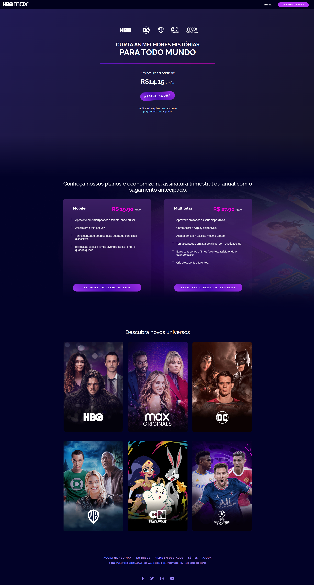
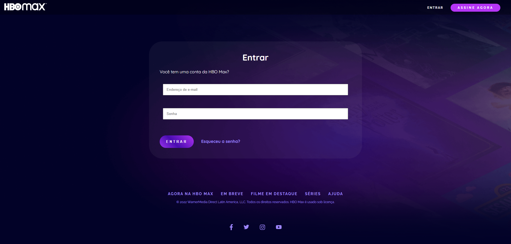

# 🎬 HBO Max UI Clone

<p align="center">
  Reprodução da interface da plataforma HBO Max, com foco em fidelidade visual, responsividade e boas práticas de desenvolvimento front-end.
</p>

<p align="center">
  <a href="#-tecnologias">Tecnologias</a>&nbsp;&nbsp;&nbsp;|&nbsp;&nbsp;&nbsp;
  <a href="#-projeto">Projeto</a>&nbsp;&nbsp;&nbsp;|&nbsp;&nbsp;&nbsp;
  <a href="#-funcionalidades">Funcionalidades</a>&nbsp;&nbsp;&nbsp;|&nbsp;&nbsp;&nbsp;
  <a href="#-layout">Layout</a>&nbsp;&nbsp;&nbsp;|&nbsp;&nbsp;&nbsp;
  <a href="https://github.com/Diegogitup?tab=repositories" target="_blank">Portfólio</a>
</p>

---

## 🚀 Tecnologias

Este projeto foi desenvolvido utilizando tecnologias fundamentais do front-end:

- <span style="color:#4ea8de"><strong>HTML5</strong></span> → Estrutura semântica e organização do conteúdo  
- <span style="color:#4ea8de"><strong>CSS3</strong></span> → Estilização avançada e responsividade  
- <span style="color:#4ea8de"><strong>Flexbox & Grid</strong></span> → Criação de layouts modernos e adaptáveis  
- <span style="color:#4ea8de"><strong>Media Queries</strong></span> → Ajustes para diferentes tamanhos de tela  
- <span style="color:#4ea8de"><strong>CSS Variables</strong></span> → Padronização de cores e fácil manutenção  
- <span style="color:#4ea8de"><strong>Animações CSS</strong></span> → Interações suaves (hover, transform, gradient)

---

## 💻 Projeto

Este projeto consiste na recriação da interface da HBO Max, com o objetivo de praticar conceitos essenciais de desenvolvimento front-end, como:

- Construção de layouts responsivos
- Organização de código CSS em escala
- Uso de boas práticas de UI (User Interface)
- Reutilização de componentes (botões, cards, header)

A aplicação simula uma landing page de streaming, contendo:

- Header fixo com navegação
- Seção de destaque com chamada principal
- Área de planos de assinatura
- Grid de conteúdos interativos
- Footer institucional

---

## ✨ Funcionalidades

✔️ Layout totalmente responsivo (mobile e desktop)  
✔️ Header fixo com adaptação para telas menores  
✔️ Cards com efeito 3D e rotação (perspective)  
✔️ Troca de imagens no hover (efeito dinâmico)  
✔️ Botões com animação (`scale` + `gradient`)  
✔️ Grid de conteúdos com interação visual  
✔️ Uso de variáveis CSS para padronização  

---

## 🎨 Layout

<p align="center">
  🔗 Clique na imagem para visualizar o projeto em funcionamento
</p>

<p align="center">
  <a href="https://diegogitup.github.io/Clone-HBO-MAX/index.html" target="_blank">  
    
    
    
  </a>
</p>

---

## 🧠 Aprendizados

Durante o desenvolvimento deste projeto, foram consolidados conhecimentos importantes como:

- Controle de overflow e scroll horizontal
- Estruturação de layouts com Flexbox e Grid
- Aplicação de animações com `transform` e `transition`
- Organização de CSS para reaproveitamento

---

## 📁 Estrutura do Projeto

```bash
📦 projeto-hbomax
 ┣ 📂 assets
 ┃ ┣ 📂 images
 ┣ 📂 style
 ┃ ┣ 📄 variaveis.css
 ┃ ┗ 📄 styles.css
 ┣ 📄 index.html
 ┗ 📄 login.html